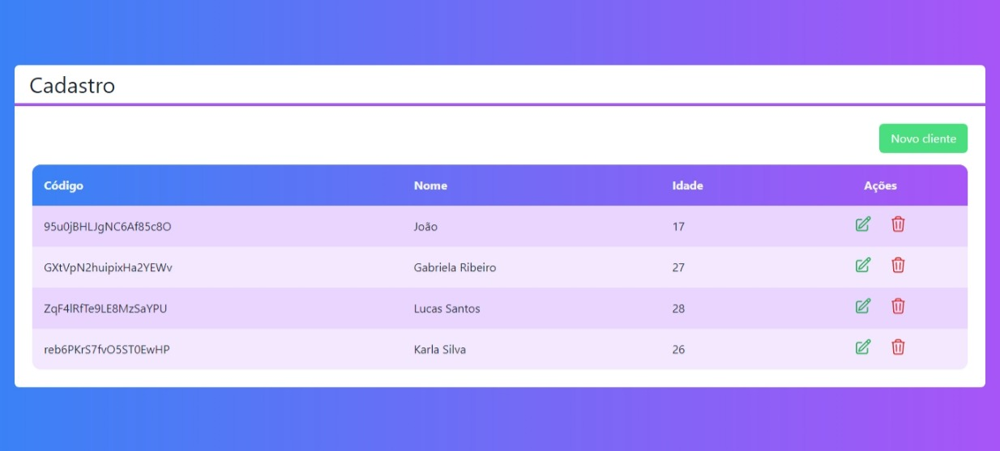
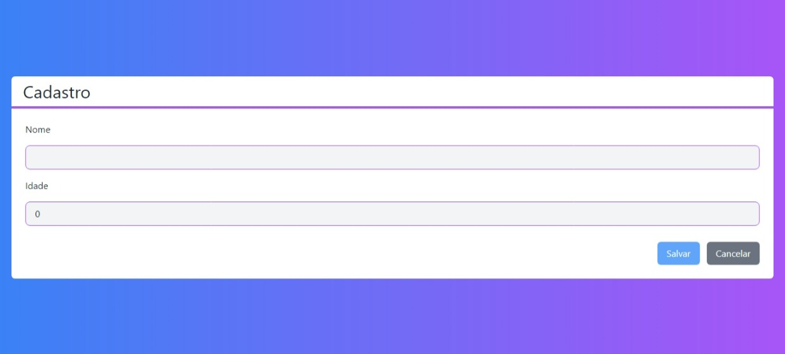

# 👩🏽‍💻 Aplicação CRUD 

## Tabela de conteúdos

   - [Sobre](#Sobre)
      - [Funcionalidades](#funcionalidades)
      - [Screenshot](#screenshot)
   - [Tecnologias](#tecnologias)
   - [Ferramentas de desenvolvimento](#ferramentas-de-desenvolvimento)
   - [Aprendizado](#aprendizado)
   - [Redes Sociais](#redes-sociais)

## Sobre

Essa aplicação CRUD é um projeto de cadastro do curso de Web Moderno da Cod3r. O projeto foi feito com Next.js e integrado com um banco de dados (Firestore).

### Funcionalidades

Os usuários devem estar aptos a:

- Adicionar novo cliente
- Editar dados de um cliente
- Excluir um cliente

### Screenshot

Como o projeto ainda não foi hospedado, abaixo se encontra um screenshot.

## Tecnologias

As tecnologias que utilizei para desenvolver esse projeto foram: 

 
   

## Ferramentas de desenvolvimento

 

## Aprendizado

Nesse projeto eu aprendi a:

- Configurar o Next.js, TailwindCSS e Firebase em um projeto
- Hooks
- Criar um projeto no Firebase
- useState 
- Variáveis em Typescript

